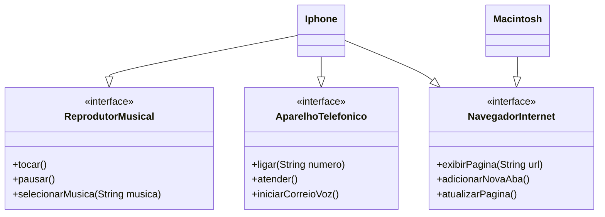

# Diagrama de classes

```mermaid
classDiagram
    class Iphone {
    }
    
    class ReprodutorMusical {
        <<interface>>
        +tocar()
        +pausar()
        +selecionarMusica(String musica)
    }
    
    class AparelhoTelefonico {
        <<interface>>
        +ligar(String numero)
        +atender()
        +iniciarCorreioVoz()
    }
    
    class NavegadorInternet {
        <<interface>>
        +exibirPagina(String url) 
        +adicionarNovaAba() 
        +atualizarPagina()
    }
    class Macintosh{

    }
    Macintosh --|> NavegadorInternet
    Iphone --|> ReprodutorMusical
    Iphone --|> AparelhoTelefonico
    Iphone --|> NavegadorInternet


```